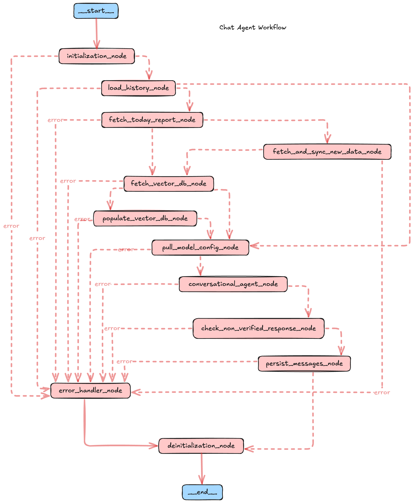

# Credit Chat Assistant

## Introduction
This project is a real-time speech processing WebSocket API built using FastAPI. It allows clients to send 

## Basic / Prerequisites Setup:
- The [setupREADME.md](./setup/setupREADME.md) file contains the initial setup steps that needs to followed.

## Directory Structure

```bash
credit_chat_agent/
├── Dockerfile
├── README.md
├── app
│   ├── attribute_selector
│   │   ├── evaluation_attributes.py
│   │   ├── finetune_attributes.py
│   │   ├── log_attributes.py
│   │   ├── metadata_attributes.py
│   │   └── user_attributes.py
│   ├── controllers
│   │   ├── __init__.py
│   │   ├── data_ingestion_controller.py
│   │   ├── evaluation_controller.py
│   │   ├── finetune_controller.py
│   │   ├── log_controller.py
│   │   ├── metadata_controller.py
│   │   └── user_controller.py
│   ├── db
│   │   ├── __init__.py
│   │   └── seeder.py
│   ├── dependencies
│   │   ├── data_ingestion_dependencies.py
│   │   ├── evaluation_dependencies.py
│   │   ├── finetune_dependencies.py
│   │   ├── log_dependencies.py
│   │   ├── metadata_dependencies.py
│   │   └── user_dependencies.py
│   ├── middleware
│   │   └── auth_middleware.py
│   ├── repositories
│   │   ├── evaluation_repositories.py
│   │   ├── finetune_repositories.py
│   │   ├── log_repositories.py
│   │   ├── metadata_repositories.py
│   │   └── user_repositories.py
│   ├── routes
│   │   ├── __init__.py
│   │   ├── data_ingestion_route.py
│   │   ├── evaluation_route.py
│   │   ├── finetune_route.py
│   │   ├── log_route.py
│   │   ├── metadata_route.py
│   │   └── user_route.py
│   ├── schemas
│   │   ├── __init__.py
│   │   ├── auth_schema.py
│   │   ├── data_ingestion_schema.py
│   │   ├── evaluation_schema.py
│   │   ├── finetune_schema.py
│   │   ├── log_schema.py
│   │   ├── metadata_schema.py
│   │   └── user_schema.py
│   ├── services
│   │   ├── data_ingestor.py
│   │   ├── llm_finetune.py
│   │   ├── pinecone_vectorizer.py
│   │   ├── qa_evaluator.py
│   │   └── qa_generator.py
│   └── utils
│       ├── __init__.py
│       ├── config.py
│       ├── constants.py
│       ├── exceptions.py
│       ├── helpers
│       │   ├── auth_helper.py
│       │   ├── common_helper.py
│       │   ├── date_helper.py
│       │   ├── file_helper.py
│       │   ├── openai_token_counter.py
│       │   ├── password_helper.py
│       │   └── prompt_helper.py
│       ├── logger.py
│       └── prompts.yaml
├── app.log
├── docker-compose.yml
├── docs
│   └── pull_request_template.md
├── main.py
├── requirements.txt
└── uploads         
```


## **Model Finetune Workflow:**
  
  ### GPT Model Finetune Process

This workflow outlines the steps involved in the fine-tuning process of a GPT model, detailing data ingestion, text processing, QA generation, and model fine-tuning.

#### Data Ingestor

1. **Input Files (Process PDF, Docs, DOCX, Audio, and Text):**
   - **Audio Input:** Converts audio to text using a tool like Whisper.
   - **Image Input:** Converts image to text using a text extraction tool.
   - **PDF Input:** Converts PDF to text using a text extraction tool.
   - **DOCX Input:** Converts DOCX to text using a text extraction tool.
   - **Text Input:** If already in text form, passes directly.

2. **Extracted Text:**
   - Outputs text from each input format for further processing.

#### QA Generator

1. **Text Cleaning:**
   - Cleans and processes extracted text.

2. **Chunking:**
   - Divides cleaned text into chunks for processing.

3. **Is All Chunk Processed?**
   - If yes, proceeds to question generation.
   - If not, check for missing data or processing errors.

4. **Question and Answer Generation:**
   - **Question Extraction:** Generates questions based on chunk data using OpenAI.
   - **Answer Generation:** Generates answers from the source context and questions using OpenAI.
   - Outputs generated questions and answers as a JSON file.

#### LLM Finetune

1. **Convert to JSON Structure:**
   - Converts the processed data to JSON format suitable for fine-tuning.

2. **Upload JSON for Fine-tuning:**
   - Validates the input file.

3. **Start Fine-tune Process:**
   - Begins fine-tuning using the JSON data on an OpenAI server.

4. **Final Tuned Model:**
   - Completes the fine-tuning and outputs a fine-tuned model with a Model ID.

The process leverages data extraction, clean processing, QA generation, and model fine-tuning steps to refine and adapt a GPT model for specific requirements.
## **Model Evaluation Workflow:**

1. **Preprocessing and Embedding:**

    The process starts with preprocessing the input question and answer, followed by creating embeddings using a pre-trained model.

2. **Query Database:**

    The question embedding queries the vector database to find the closest match.
    Paths diverge depending on whether a match is found or not.

3. **Similarity Scores Calculation:**

    If matched QA pairs are found, both the matched question and answer are embedded, and their similarity with the input is calculated.
    These scores are stored for aggregation.

4. **Aggregation and Evaluation:**

    Combine scores from all evaluated pairs, including default scores.
    Calculate statistical metrics (average, standard deviation) and variability (CV).
    Apply thresholding to categorize scores as correct or incorrect.
    Compute precision, recall, F1 score, and accuracy, leading to a comprehensive evaluation.

5. **Final Output:**

    Return comprehensive evaluation results summarizing the QA model's performance.
## **Chat Agent Workflow:**
  


This diagram illustrates the process flow for a chat agent, highlighting various stages, actions, and error handling mechanisms within the workflow. Below is a brief description of each node in the flow:

#### Nodes

1. **Initialization Node:**
   - Begins the workflow process.
   - Prepares necessary components or settings.

2. **Load History Node:**
   - Loads previous interactions or data.
   - Aids in maintaining context or understanding past interactions.

3. **Fetch Today Report Node:**
   - Retrieves current reports or data.
   - Ensures the system has up-to-date information.

4. **Fetch and Sync New Data Node:**
   - Integrates fresh data into the system.
   - Keeps the database current and relevant.

5. **Fetch Vector DB Node:**
   - Accesses the vector database for further operations.
   - Utilizes embeddings or semantic data.

6. **Populate Vector DB Node:**
   - Updates or fills the vector database with necessary data.
   - Enhances the system’s ability to understand or retrieve relevant information.

7. **Pull Model Config Node:**
   - Retrieves configuration settings for the model.
   - Adjusts or optimizes the model settings.

8. **Conversational Agent Node:**
   - Handles interaction between the user and the system.
   - Acts as the primary interface for communication.

9. **Check Non-Verified Response Node:**
   - Reviews responses for accuracy or reliability.
   - Ensures system outputs are verified.

10. **Persist Messages Node:**
    - Saves interactions for future reference or analysis.
    - Maintains a history of communications.

11. **Error Handler Node:**
    - Catches and processes errors that occur during workflow execution.
    - Routes issues back to the beginning or other nodes for resolution.

12. **Deinitialization Node:**
    - Wraps up the workflow.
    - Cleans up resources and prepares for system shutdown or restart.

#### Error Handling

Throughout the flow, error paths ensure that any issues encountered at various stages are routed to an error handler, maintaining robustness and allowing for corrective actions. This systematic approach helps in maintaining continuity, consistency, and reliability within the chat agent operations.


